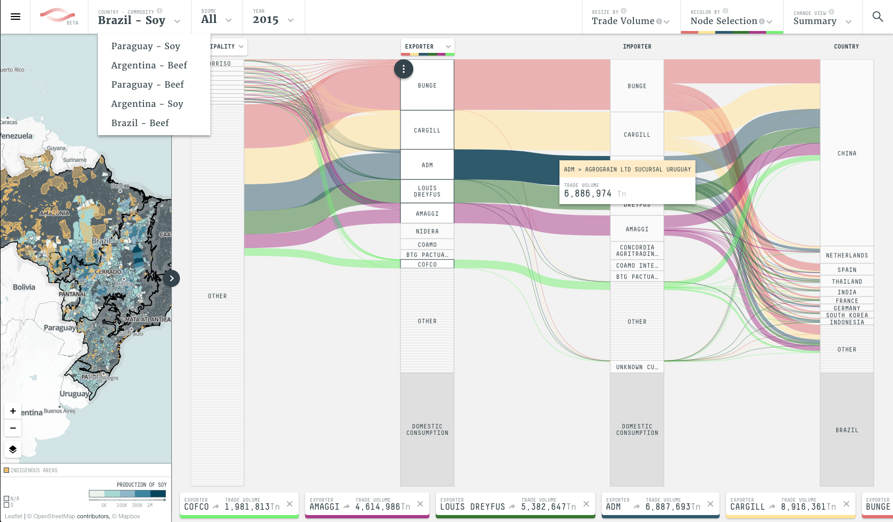

# TRASE



Source code for the [TRASE](https://trase.earth) front end.

## About TRASE

Trase brings unprecedented transparency to commodity supply chains revealing new pathways towards achieving a 
deforestation-free economy.

## About this project

This project consists of only the frontend application for the TRASE website.
All data displayed is loaded through requests to the TRASE API.

This project mainly uses D3 and Leaflet, plus Redux for managing app state. 
More on the stack [here](https://github.com/Vizzuality/TRASE-frontend/issues/9)

Besides the frontend code, the project also includes a standalone nodejs web server, which should be used only for 
development purposes


## Lexicon

```
+-------+             +-------+
|       |             |       |
|       |             |       |
+-------+ ---\        |       |
| node  |     \-------+-------+
+-------+--\  link    | node  |
|       |   \         |       |
|       |    \--------+-------+
|       |             |       |   
+-------+             +-------+
  column                column

```

## Configuration

The project's main configuration values can be set using [environment variables](https://en.wikipedia.org/wiki/Environment_variable)

* PORT: port used by the development web server. defaults to 8081
* NODE_ENV: environment used by the nodejs tasks
* AUTH_USER + AUTH_PASSWORD: if set, an auth wall is used by the nodejs development web server 
* API_V1_URL: URL of the data API V1
* API_V2_URL: URL of the data API V2
* API_CMS_URL: URL of the homepage stories API
* API_STORY_CONTENT: URL of the deep dive stories API
* GOOGLE_ANALYTICS_KEY: API key for Google Analytics

If you are using the included development server, you can set those variables in the `.env` file (use the included `
.env.sample` as an example)
 
## Development set up
- Check out the code from [github](github.com/Vizzuality/TRASE-frontend)

- Install dependencies:
```
npm i
```
- Start the development server:
```
npm run dev
```
- [http://localhost:8081/](http://localhost:8081/)

#### generate CARTO named maps

- Copy CARTO credentials:
```
cp cp ./bin/cartodb/cartodb-config.sample.json ./bin/cartodb/cartodb-config.json
```
- Replace api_key value in `cartodb-config.json` 
- To update or instantiate context layers run
```
./bin/getContextMaps.sh
```
This will use the layers configuration stored in `./bin/cartodb/templates.json` 


## Production

Run `npm run build`, it will create a production-ready version of the project in `/dist`.


## LICENSE

[MIT](LICENSE)
